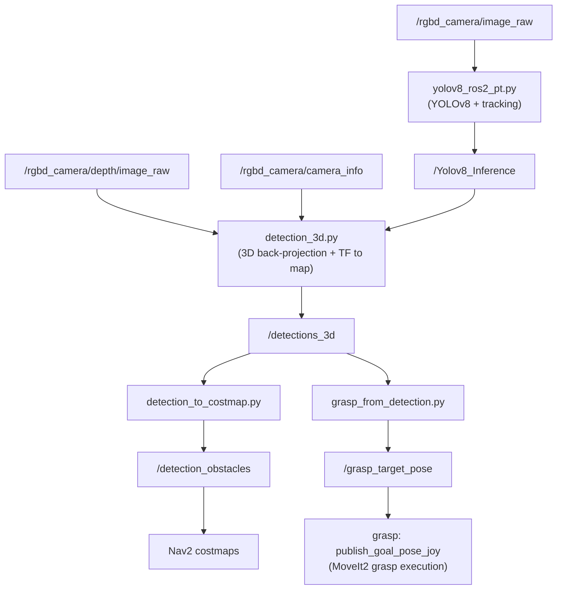

# AMR ROS2

A ROS2 Humble workspace for an omni-directional autonomous mobile robot (AMR) with a 7-DOF manipulator arm, simulated in Gazebo. The robot can map and navigate its environment, recognize objects with YOLOv8, localize them in 3D, and pick them up using MoveIt2.

## What's in this project

The robot is a four-wheel holonomic (omni-wheel) base carrying a 7-DOF arm with a gripper, a 2D LiDAR, and an RGB-D camera. On top of that base hardware, this workspace provides:

- **Mapping and navigation** — SLAM (slam_toolbox / Cartographer / RTAB-Map) and autonomous navigation with Nav2.
- **Manipulation** — MoveIt2 motion planning for the arm and gripper, with joystick teleop for manual control.
- **Object recognition** — Real-time YOLOv8 detection with object tracking, back-projected into 3D using the depth camera and published in the map frame.
- **Vision-guided grasping** — Detected objects are turned into grasp targets and Nav2 obstacles automatically.
- **Learning-based navigation** — A deep reinforcement learning (TD3/SAC) environment and an imitation learning (behavioral cloning) pipeline for training navigation policies in simulation.

## Requirements

- Ubuntu 22.04
- ROS2 Humble (desktop install recommended)
- Gazebo 11 (installed alongside `ros-humble-desktop`)
- Nav2, slam_toolbox, MoveIt2, ros2_control
- Python 3.10 with PyTorch, Ultralytics (YOLOv8), OpenCV, h5py

## Installation

### 1. Install ROS2 Humble

Follow the official instructions at https://docs.ros.org/en/humble/Installation.html and install `ros-humble-desktop`.

### 2. Clone the workspace

```bash
mkdir -p ~/amr-ros2/src
cd ~/amr-ros2
git clone <this-repo-url> .
```

(Adjust the path if you clone into an existing directory — the workspace root is expected to contain `src/`.)

### 3. Install ROS2 dependencies

```bash
sudo apt update
rosdep update
rosdep install --from-paths src --ignore-src -r -y
```

This pulls in Nav2, slam_toolbox, MoveIt2, ros2_control, twist_mux, and the other ROS packages used across the workspace.

### 4. Install Python dependencies

```bash
pip3 install torch torchvision ultralytics opencv-python h5py tqdm pyyaml
```

`ultralytics` is required by the `recognition` package for YOLOv8 inference, and `torch`/`h5py` are required by the `drl_navigation` and `imitation_learning` packages.

### 5. Build the workspace

```bash
cd ~/amr-ros2
colcon build --symlink-install
source install/setup.bash
```

Source `install/setup.bash` in every new terminal (or add it to your `~/.bashrc`).

## Workspace layout

| Package | Type | Description |
|---|---|---|
| `robot_description` | URDF/Xacro | Robot model: omni-wheel base, 7-DOF arm, gripper, LiDAR, RGB-D camera |
| `drl_navigation` | C++/Python | Gazebo training world + TD3/SAC reinforcement learning navigation |
| `imitation_learning` | Python | Behavioral cloning navigation: data collection, training, evaluation |
| `vslam_navigation` | Config | SLAM (slam_toolbox/Cartographer/RTAB-Map) and Nav2 navigation bringup |
| `recognition` (`yolov8_recognition`) | Python | YOLOv8 detection + tracking, 3D localization, costmap obstacles, grasp targets |
| `yolov8_msgs` | Messages | Custom messages for YOLOv8 inference results |
| `moveit` (`omni_robot_moveit_config`) | Config | MoveIt2 configuration for the arm and gripper |
| `grasp` (`grasping`) | C++ | Joystick and vision-driven arm control via MoveIt2 |
| `omni_drive` | Python | Joystick teleop for the omni-wheel base |
| `models` | Assets | Gazebo models used by the simulation worlds |
| `yolo3d` | Python | Earlier YOLOv5-based 3D detection prototype, superseded by `recognition` |

## Usage

All commands assume the workspace has been built and `install/setup.bash` has been sourced.

### Simulate the robot

Launch Gazebo with the training world and spawn the robot:

```bash
ros2 launch drl_navigation launch_sim.launch.py
```

Use `gui:=false` for a headless run.

### Manual teleoperation

Drive the base with a joystick:

```bash
ros2 launch omni_drive vel_controller.launch.py
```

Control the arm and gripper with a joystick (requires MoveIt, see below):

```bash
ros2 launch grasp move_arm_joy.launch.py
```

### SLAM and navigation

With the simulation running, build a map and navigate with Nav2:

```bash
ros2 launch vslam_navigation slam_navigation.launch.py
```

This brings up `slam_toolbox` (online async SLAM) and the Nav2 stack (planner, controller, behavior server, BT navigator) using the configs in `vslam_navigation/config/`.

### Object recognition, 3D localization, and grasping

```bash
ros2 launch yolov8_recognition launch_yolov8.launch.py
```

This launches four nodes that together turn camera images into actionable 3D information:

1. **`yolov8_ros2_pt.py`** — runs YOLOv8 with object tracking on `/rgbd_camera/image_raw`, publishing `/Yolov8_Inference` (class, confidence, track ID, bounding box).
2. **`detection_3d.py`** — back-projects each detection into 3D using the depth image and camera intrinsics, transforms it into the `map` frame, and publishes `/detections_3d` (`vision_msgs/Detection3DArray`).
3. **`detection_to_costmap.py`** — converts `/detections_3d` into a point cloud on `/detection_obstacles`, which is fed into the Nav2 local and global costmaps as an additional obstacle source.
4. **`grasp_from_detection.py`** — watches `/detections_3d` for a stable detection of a configured `target_class` and publishes a grasp pose on `/grasp_target_pose`.



The target class and confidence threshold can be set at launch or at runtime, e.g.:

```bash
ros2 param set /grasp_from_detection target_class bottle
```

`/grasp_target_pose` is consumed by the `grasp` package's `publish_goal_pose_joy` node, which plans and executes an approach-and-grasp motion with MoveIt2.

### Arm motion planning (MoveIt2)

```bash
ros2 launch moveit demo.launch.py
```

Brings up `move_group`, RViz, and the MoveIt motion planning interface for the arm and gripper.

### Reinforcement learning navigation (TD3/SAC)

```bash
ros2 launch drl_navigation launch_sim.launch.py gui:=false
python3 src/drl_navigation/train.py
```

Trained models are saved under `src/drl_navigation/models/`.

### Imitation learning navigation

```bash
ros2 launch imitation_learning imitation_learning.launch.py
```

Then run `collect_data.py` to record demonstrations and `train_imitation_learning.py` to train a policy from the collected dataset (`src/imitation_learning/data/training_data.hdf5`).

## License

All packages in this workspace are released under the MIT License (see each package's `package.xml`).
